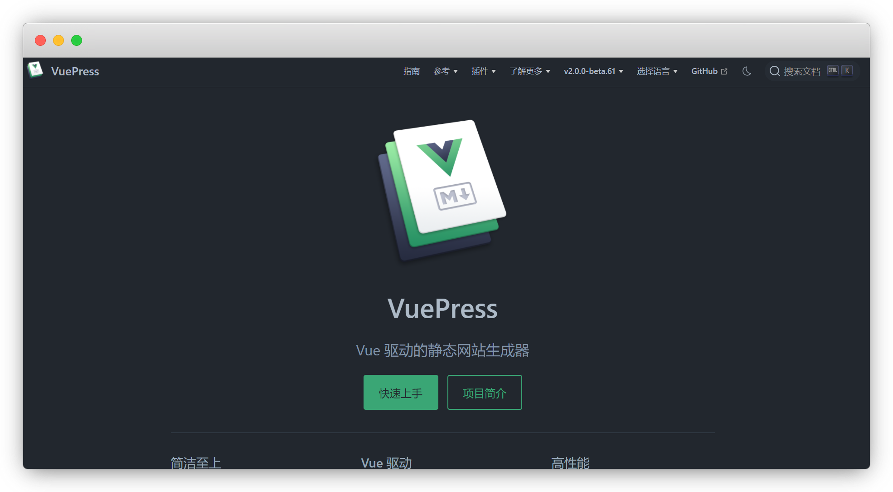

# 前言

::: warning 更新时间
最近更新：2023-5-14

搭建版本：v2.0-beta.61
:::

## 始前建言

在阅读本章节之前，请确保你已经对 `Markdown` 有所了解，否则你会因为理解难而无从下手。

如果你还不了解 `Markdown` ，请先学习一些 Markdown 教程

* PC端 ： [Typora·已收费](https://typoraio.cn/)丨[VSCode·免费](../VSCode/README.md)

* 手机端：[Mweb·IOS](https://zh.mweb.im/)丨[Markor·安卓](https://github.com/gsantner/markor/releases)

* 网页端：[雷欧的前端客栈](https://www.xkboke.com/web-inn/onlineTool/markdown-online.html)丨[Marked Demo](https://marked.js.org/demo/)

* 参考教程：[https://yiov.github.io/daily/markdown/](https://yiov.github.io/daily/markdown/)

## Vuepress

### 起因

由于我的 [github](https://github.com/Yiov/notes) 上的文章多找起来繁琐，就想到搭建一个网站，方便查阅
  
然而我在github上都是用的 `markdown` 编写文章，而搭建博客的话又要重新写一遍，要疯

### 缘来

直到发现了 [vuepress](https://github.com/vuepress/vuepress-next) <Badge type="warning" text="v2.0" vertical="top" /> 就是基于markdown语法，这就是传说中的梦中情人吧

::: tip 版本说明
我放弃v1版的主要原因是：无深色主题
:::

* 官方V2.0版文档：[https://v2.vuepress.vuejs.org/zh/](https://v2.vuepress.vuejs.org/zh/)

## 其他主题

你要是嫌弃麻烦可以直接用其他主题，也有搭建教程

* [npmjs社区主题](https://www.npmjs.com/search?q=keywords:vuepress-theme)

* [vuepress-theme-reco](http://v2.vuepress-reco.recoluan.com/)「v2版」

* [vuepress-theme-vdoing](https://doc.xugaoyi.com/)「v1基础搭建」

* [官方主题开发](https://v2.vuepress.vuejs.org/zh/advanced/theme.html)

