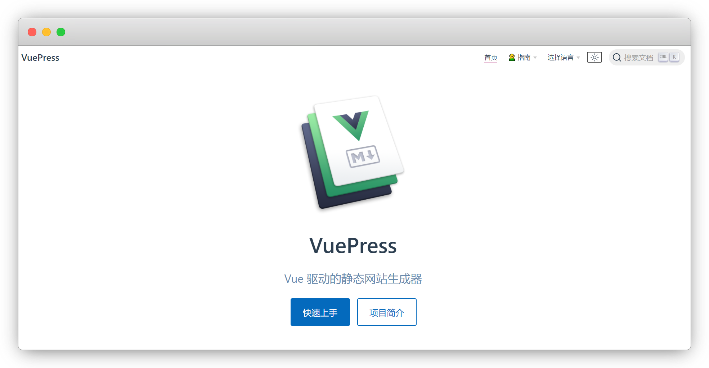
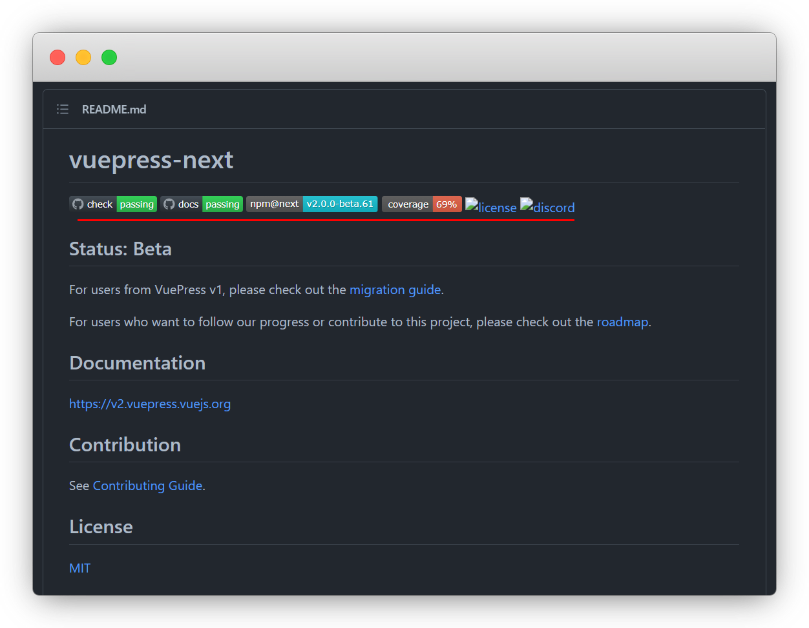
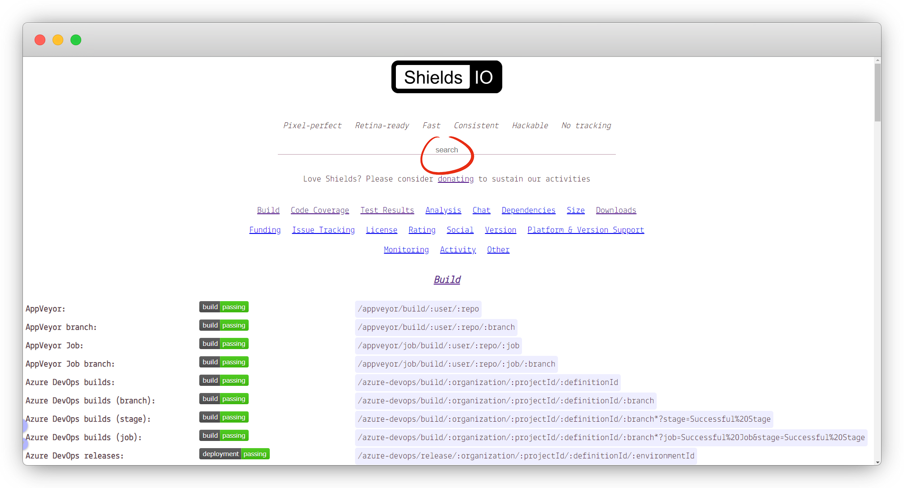

# 样式美化

::: warning 更新时间
最近更新：2023-7-3

搭建版本：v2.0-beta.63
:::

## Palette 文件

::: tip 说明
若无必要，不建议修改

修改方式请参照style，一样的
:::

```目录
├─ docs
│  ├─ .vuepress
│  │  └─ styles
│  │      └─ palette.scss   <--- 样式变量
└─ README.md
```

你可以利用它来覆盖默认主题的预定义 SASS 变量

::: details 点击查看预定义CSS变量
```scss
// responsive breakpoints
$MQNarrow: 959px !default;
$MQMobile: 719px !default;
$MQMobileNarrow: 419px !default;
```
:::


## Style 文件

我们可以通过css变量覆盖默认主题的css变量

::: tip 说明
官方给的路径，是让我们新建一个 `styles` 文件夹，然后新建一个 `index.scss` 文件
:::

```目录
├─ docs
│  ├─ .vuepress
│  │  └─ styles
│  │      └─ index.scss   <--- css变量路径
└─ README.md
```

因为页面亮色和暗色两种模式，所以我们必须同时考虑两个主题色的替换

在 `index.scss`文件中添加2个引用

```scss
@use 'vars';
@use 'vars-dark';
```

然后新建两个文件：`vars.scss` 和 `vars-dark.scss`

::: tip 说明
vars.scss 复制亮色变量代码，粘贴保存

vars-dark.scss 复制暗色变量代码，粘贴保存
:::

::: details 点击查看亮色CSS变量
```scss
:root {
    // 按钮颜色
    --c-brand: #3eaf7c;
    --c-brand-light: #4abf8a;
  
    // 背景颜色
    --c-bg: #ffffff;
    --c-bg-light: #f3f4f5;
    --c-bg-lighter: #eeeeee;
    --c-bg-dark: #ebebec;
    --c-bg-darker: #e6e6e6;
    --c-bg-navbar: var(--c-bg);
    --c-bg-sidebar: var(--c-bg);
    --c-bg-arrow: #cccccc;
  
    // 文字颜色
    --c-text: #2c3e50;
    --c-text-accent: var(--c-brand);
    --c-text-light: #3a5169;
    --c-text-lighter: #4e6e8e;
    --c-text-lightest: #6a8bad;
    --c-text-quote: #999999;
  
    // 边框颜色
    --c-border: #eaecef;
    --c-border-dark: #dfe2e5;
  
    // 自定义容器颜色
    --c-tip: #42b983;
    --c-tip-bg: var(--c-bg-light);
    --c-tip-title: var(--c-text);
    --c-tip-text: var(--c-text);
    --c-tip-text-accent: var(--c-text-accent);
    --c-warning: #ffc310;
    --c-warning-bg: #fffae3;
    --c-warning-bg-light: #fff3ba;
    --c-warning-bg-lighter: #fff0b0;
    --c-warning-border-dark: #f7dc91;
    --c-warning-details-bg: #fff5ca;
    --c-warning-title: #f1b300;
    --c-warning-text: #746000;
    --c-warning-text-accent: #edb100;
    --c-warning-text-light: #c1971c;
    --c-warning-text-quote: #ccab49;
    --c-danger: #f11e37;
    --c-danger-bg: #ffe0e0;
    --c-danger-bg-light: #ffcfde;
    --c-danger-bg-lighter: #ffc9c9;
    --c-danger-border-dark: #f1abab;
    --c-danger-details-bg: #ffd4d4;
    --c-danger-title: #ed1e2c;
    --c-danger-text: #660000;
    --c-danger-text-accent: #bd1a1a;
    --c-danger-text-light: #b5474d;
    --c-danger-text-quote: #c15b5b;
    --c-details-bg: #eeeeee;
  
    // badge组件的颜色
    --c-badge-tip: var(--c-tip);
    --c-badge-warning: #ecc808;
    --c-badge-warning-text: var(--c-bg);
    --c-badge-danger: #dc2626;
    --c-badge-danger-text: var(--c-bg);
  
    // 过渡变量
    --t-color: 0.3s ease;
    --t-transform: 0.3s ease;
  
    // 代码块变量
    --code-bg-color: #282c34;
    --code-hl-bg-color: rgba(0, 0, 0, 0.66);
    --code-ln-color: #9e9e9e;
    --code-ln-wrapper-width: 3.5rem;
  
    // 字体变量
    --font-family: -apple-system, BlinkMacSystemFont, 'Segoe UI', Roboto, Oxygen,
      Ubuntu, Cantarell, 'Fira Sans', 'Droid Sans', 'Helvetica Neue', sans-serif;
    --font-family-code: Consolas, Monaco, 'Andale Mono', 'Ubuntu Mono', monospace;
  
    // 布局变量
    --navbar-height: 3.6rem;
    --navbar-padding-v: 0.7rem;
    --navbar-padding-h: 1.5rem;
    --sidebar-width: 20rem;
    --sidebar-width-mobile: calc(var(--sidebar-width) * 0.82);
    --content-width: 740px;
    --homepage-width: 960px;
  }
  
  // 插件：返回顶部
  .back-to-top {
    --back-to-top-color: var(--c-brand);
    --back-to-top-color-hover: var(--c-brand-light);
  }
  
  // 插件：docsearch
  .DocSearch {
    --docsearch-primary-color: var(--c-brand);
    --docsearch-text-color: var(--c-text);
    --docsearch-highlight-color: var(--c-brand);
    --docsearch-muted-color: var(--c-text-quote);
    --docsearch-container-background: rgba(9, 10, 17, 0.8);
    --docsearch-modal-background: var(--c-bg-light);
    --docsearch-searchbox-background: var(--c-bg-lighter);
    --docsearch-searchbox-focus-background: var(--c-bg);
    --docsearch-searchbox-shadow: inset 0 0 0 2px var(--c-brand);
    --docsearch-hit-color: var(--c-text-light);
    --docsearch-hit-active-color: var(--c-bg);
    --docsearch-hit-background: var(--c-bg);
    --docsearch-hit-shadow: 0 1px 3px 0 var(--c-border-dark);
    --docsearch-footer-background: var(--c-bg);
  }
  
  // 插件：外部链接图标
  .external-link-icon {
    --external-link-icon-color: var(--c-text-quote);
  }
  
  // 插件：图片缩放
  .medium-zoom-overlay {
    --medium-zoom-bg-color: var(--c-bg);
  }
  
  // 插件：进度条
  #nprogress {
    --nprogress-color: var(--c-brand);
  }
  
  // 插件：pwa弹窗组件
  .pwa-popup {
    --pwa-popup-text-color: var(--c-text);
    --pwa-popup-bg-color: var(--c-bg);
    --pwa-popup-border-color: var(--c-brand);
    --pwa-popup-shadow: 0 4px 16px var(--c-brand);
    --pwa-popup-btn-text-color: var(--c-bg);
    --pwa-popup-btn-bg-color: var(--c-brand);
    --pwa-popup-btn-hover-bg-color: var(--c-brand-light);
  }
  
  // 插件：本地搜索
  .search-box {
    --search-bg-color: var(--c-bg);
    --search-accent-color: var(--c-brand);
    --search-text-color: var(--c-text);
    --search-border-color: var(--c-border);
  
    --search-item-text-color: var(--c-text-lighter);
    --search-item-focus-bg-color: var(--c-bg-light);
  }
```
:::


::: details 点击查看暗黑模式CSS变量
```scss
html.dark {
  // 按钮颜色
  --c-brand: #3aa675;
  --c-brand-light: #349469;

  // 背景颜色
  --c-bg: #22272e;
  --c-bg-light: #2b313a;
  --c-bg-lighter: #262c34;
  --c-bg-dark: #343b44;
  --c-bg-darker: #37404c;

  // 文字颜色
  --c-text: #adbac7;
  --c-text-light: #96a7b7;
  --c-text-lighter: #8b9eb0;
  --c-text-lightest: #8094a8;

  // 边框颜色
  --c-border: #3e4c5a;
  --c-border-dark: #34404c;

  // 自定义容器颜色
  --c-tip: #318a62;
  --c-warning: #e0ad15;
  --c-warning-bg: #2d2f2d;
  --c-warning-bg-light: #423e2a;
  --c-warning-bg-lighter: #44442f;
  --c-warning-border-dark: #957c35;
  --c-warning-details-bg: #39392d;
  --c-warning-title: #fdca31;
  --c-warning-text: #d8d96d;
  --c-warning-text-accent: #ffbf00;
  --c-warning-text-light: #ddb84b;
  --c-warning-text-quote: #ccab49;
  --c-danger: #fc1e38;
  --c-danger-bg: #39232c;
  --c-danger-bg-light: #4b2b35;
  --c-danger-bg-lighter: #553040;
  --c-danger-border-dark: #a25151;
  --c-danger-details-bg: #482936;
  --c-danger-title: #fc2d3b;
  --c-danger-text: #ea9ca0;
  --c-danger-text-accent: #fd3636;
  --c-danger-text-light: #d9777c;
  --c-danger-text-quote: #d56b6b;
  --c-details-bg: #323843;

  // badge组件的颜色
  --c-badge-warning: var(--c-warning);
  --c-badge-warning-text: #3c2e05;
  --c-badge-danger: var(--c-danger);
  --c-badge-danger-text: #401416;

  // 代码块变量
  --code-hl-bg-color: #363b46;
}

// 插件：本地搜索
html.dark .DocSearch {
  --docsearch-logo-color: var(--c-text);
  --docsearch-modal-shadow: inset 1px 1px 0 0 #2c2e40, 0 3px 8px 0 #000309;
  --docsearch-key-shadow: inset 0 -2px 0 0 #282d55, inset 0 0 1px 1px #51577d,
    0 2px 2px 0 rgba(3, 4, 9, 0.3);
  --docsearch-key-gradient: linear-gradient(-225deg, #444950, #1c1e21);
  --docsearch-footer-shadow: inset 0 1px 0 0 rgba(73, 76, 106, 0.5),
    0 -4px 8px 0 rgba(0, 0, 0, 0.2);
}
```
:::


按照自己的需求对颜色进行更改，保存后如果没有发生变化，就在配置里引用一下

已经变了，就不用这段代码

```ts{6-7}
export default {
  //========logo路径========//
  head: [['link', 
  //favicon图标
  { rel: 'icon', href: '/images/logo.png' },
  //自定义css样式
  { rel: 'stylesheet', href: '/styles/index.scss' },
]],
}
```


另一种是直接在页面引用style代码，比如：在 <Badge type="warning" text="首页README.md文件" vertical="middle" /> 里添加

::: tip 说明
style代码里不要含有//等注释符号
:::

```scss
<style>
:root {
    --c-brand: #046abd;
    --c-brand-light: #046abd;
}
</style>
```




其他页面也是可以更改的，可以参照官方进行更改

```路径
原始路径：node_modules\@vuepress\theme-default\lib\client\styles
```


## 代码精简

上面我们发现引用可以index进行引用，那么我们其他代码是否可以呢，以便达到代码简化

我们以`侧边栏导航`为例，看目录


```目录
├─ docs
│  ├─ .vuepress
│  │  └─ configs
│  │      └─ index.ts     <--- 主配置文件
│  │      └─ sidebar.ts   <--- 侧边栏配置文件
└─ README.md
```

新建一个 `configs` 文件夹，然后再新建 `index.ts` 和 `sidebar.ts` 文件

在 `index.ts` 文件中写

```ts
export * from './sidebar'
```

在 `sidebar.ts` 文件中写

```ts
import type { SidebarConfig } from '@vuepress/theme-default'

//将这一段导航定义为：sidebarA
export const sidebarA: SidebarConfig = {
    //原先侧边栏config的配置复制过来
    '/guide/': [
        {
          text: '指南',
          children: [
            '/guide/README.md', 
            '/guide/getting-started.md', 
            '/guide/configuration.md', 
            '/guide/page.md',
            '/guide/markdown.md',
            '/guide/assets.md',
            '/guide/beautification.md', 
          ],
          collapsible: true, //折叠开关
        },
      ],
}
```

最后我们回到 `config.ts` 里去引用一下就OK了

```ts{5-6}
import { sidebarA } from './configs/index.js'

export default {
  theme: defaultTheme({
    //删掉原来的引用侧边栏
    sidebar: sidebarA,
  })
}
```

同样的我们还可以进行导航栏的简化，这里就不演示了


## 项目徽标

无论文档还是github项目都会见到这种



官网：[https://shields.io/](https://shields.io/)

`serch` 处输入你的github项目链接，选择要生成的徽标，生成后，选择Markdown格式即可



::: tip 说明
其他徽标：

[https://github.com/Ileriayo/markdown-badges](https://github.com/Ileriayo/markdown-badges)

[https://github.com/Envoy-VC/awesome-badges](https://github.com/Envoy-VC/awesome-badges)
:::


## 组件替换

对某个布局不满意，我们可以直接替换

我们以 `主页` 布局演示

```目录
├─ docs
│  ├─ .vuepress
│  │  └─ components
│  │      └─ MyHome.vue     <--- 主页组件
└─ README.md
```

新建一个 `components` 文件夹，再新建一个 `MyHome.vue` 文件

在 `MyHome.vue` 文件中写入


默认主题将所有非全局的组件都注册了一个带 `@theme` 前缀的 `alias` 

::: tip 说明
例如，Home.vue 的别名是 @theme/Home.vue
:::

```ts{7-14}
import { getDirname, path } from '@vuepress/utils'

const __dirname = getDirname(import.meta.url)

export default ({
  theme: defaultTheme {},
  //组件覆盖
  alias: {
    '@theme/HomeFooter.vue': path.resolve(__dirname, './components/MyHomeFooter.vue'),
  },
})
```


```路径
原始路径：node_modules\@vuepress\theme-default\lib\client\components
```