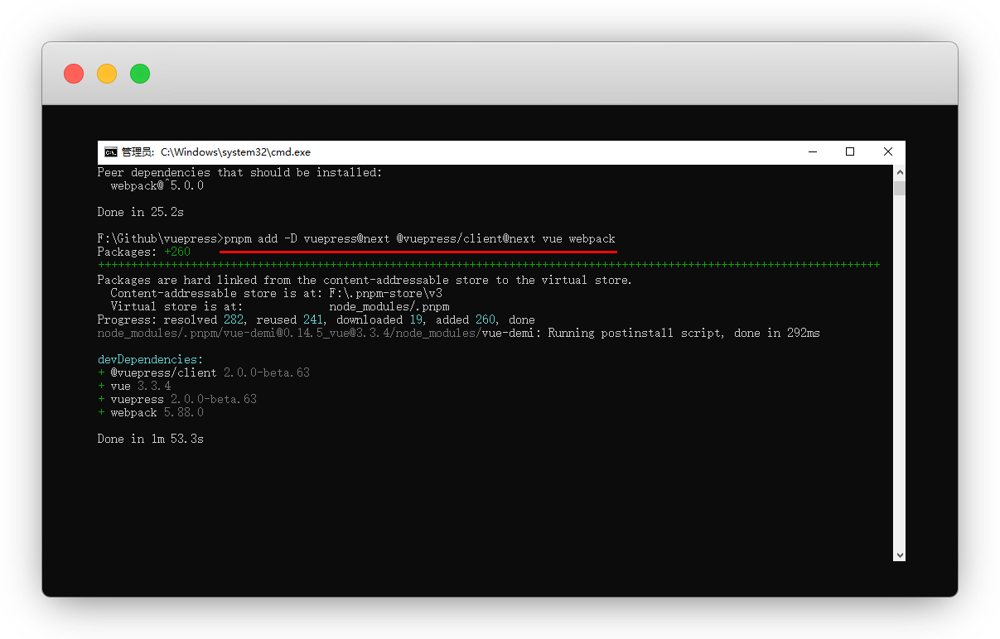

# 快速上手

::: warning 更新时间
最近更新：2023-7-3

搭建版本：v2.0-beta.63
:::

那我们就来学习如何的搭建vuepress，就是你现在看到的这种文档网站


## 工具

::: tip 说明
已经安装 或者 熟练了，可以不用看此步骤
:::

* [安装nodejs](https://yiov.github.io/website/nodejs#window%E5%AE%89%E8%A3%85)  [必装，`v18.14.2` 报错，于是退选了<Badge type="warning" text="v16.19.1" vertical="middle" />]


* [安装vscode](https://yiov.github.io/daily/VSCode/)  [建议安装]


* [安装git](https://yiov.github.io/daily/git)  [可选]


## 准备

::: tip 说明
已经安装 或者 熟练了，可以不用看此步骤
:::

### pnpm/yarn

通过 npm 安装 [yarn](https://www.yarnpkg.cn/) 或者 新出的[pnpm](https://pnpm.io/zh/)


:::: code-group
::: code-group-item pnpm
```sh
#安装pnpm
npm install -g pnpm
#查看版本号
pnpm -v
```
:::
::: code-group-item yarn
```sh
#安装yarn
npm install -g yarn
#查看版本号
yarn -v
```
:::
::::


### 创建目录

先WIN+R键，输入cmd


确定一个盘符，我是放f盘符，回车

```sh
#盘符可以自己定
f:
```


创建vuepress目录，名字可以自己定


```sh
#目录可以自定义
mkdir vuepress

#目录和上面保持一致
cd vuepress
```

:::: tip 说明
我为了便于分类我还创建了github目录，然后又在目录里新建了vuepress文件夹

觉得麻烦的可以直接电脑创建

::: details 我的目录参考
```sh
#创建Github目录并进入
mkdir -p Github & cd Github

#创建vuepress目录并进入
mkdir -p vuepress & cd vuepress
```
:::
::::


::: tip 说明
亦可以电脑创建好一个空文件夹

在当前文件夹地址栏输入`cmd` 快捷进入
:::


## 安装

### 初始化

:::: code-group
::: code-group-item pnpm
```sh
#初始化pnpm
pnpm init
```
:::
::: code-group-item yarn
```sh
#初始化yarn 一路回车
yarn init

#或者用一键y命令
#yarn init -y
```
:::
::: code-group-item npm
```sh
#初始化npm
npm init
```
:::
::::


### 安装依赖

::: tip vite说明
从v2版本开始，默认使用的是 [Vite](https://vitejs.dev/) 打包工具，[webpack](https://webpack.js.org/)编译慢，不建议使用
:::


:::: code-group
::: code-group-item pnpm
```sh
#安装 新增webpack/vue和@vuepress/client
pnpm add -D vuepress@next @vuepress/client@next vue webpack
```
:::
::: code-group-item yarn
```sh
#安装含Vite
yarn add -D vuepress@next

#卸载
#yarn remove vuepress
```
:::
::: code-group-item npm
```sh
#安装含Vite
npm install -D vuepress@next
```
:::
::::





### 脚本命令

在 `package.json` 中添加一些 scripts 命令，保存

::: tip 命令解析
执行命令 `docs:dev`，就会运行 `vuepress dev docs`

执行命令 `docs:build`，就会运行 `vuepress build docs`
:::

```json{3-4}
,
  "scripts": {
    "docs:dev": "vuepress dev docs",
    "docs:build": "vuepress build docs"
  }
```


### .gitignore

添加.gitignore文件，主要用于上传到gitee/github

::: warning 注意
.gitignore 里放的是上传时git的忽略项

建议先使用cmd，使用vscode有可能会出现乱码
:::

```sh
#将依赖文件添加到.gitignore文件中
echo node_modules >> .gitignore

#将临时目录添加到.gitignore文件中
echo .temp >> .gitignore

#将缓存目录添加到.gitignore文件中
echo .cache >> .gitignore

#将静态目录添加到.gitignore文件中
echo dist >> .gitignore
```


::: tip Github上传未忽略dist文件夹
原因：vscode输入命令导致编码错误

解决：Github Desktop - Repository settings - ignored files

输入我们忽略的dist文件即可，save保存即可

```忽略项
node_modules
.temp
.cache
dist
```
:::


### 创建文档

::: warning 注意
建议先使用cmd，使用vscode有可能会出现乱码

实在搞不定，就手动新建一样的
:::

创建你的第一篇文档

```sh
mkdir docs
echo '# Hello VuePress' > docs/README.md
```


## 本地启动

在本地启动服务器，来开发你的文档网站

::: tip 如何退出
本次执行的其实就是我们在 [脚本命令](#脚本命令) 中的命令

另：`ctrl+c` 即可退出开发模式
:::


:::: code-group
::: code-group-item pnpm
```sh
#开发环境
pnpm docs:dev
```
:::
::: code-group-item yarn
```sh
#开发环境
yarn docs:dev
```
:::
::: code-group-item npm
```sh
#开发环境
npm docs:dev
```
:::
::::

VuePress会在本地启动一个热重载的开发服务器，当你修改你的 Markdown 文件时，浏览器中的内容也会自动更新

[http://localhost:8080](http://localhost:8080)


成功看到页面，就说明我们的vuepress就搭建完成了


