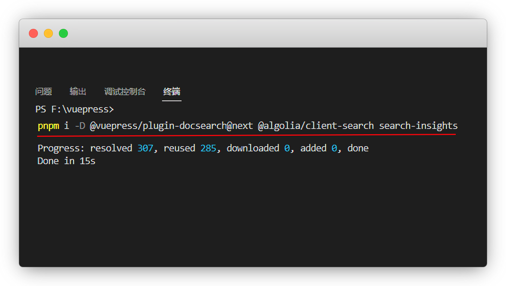
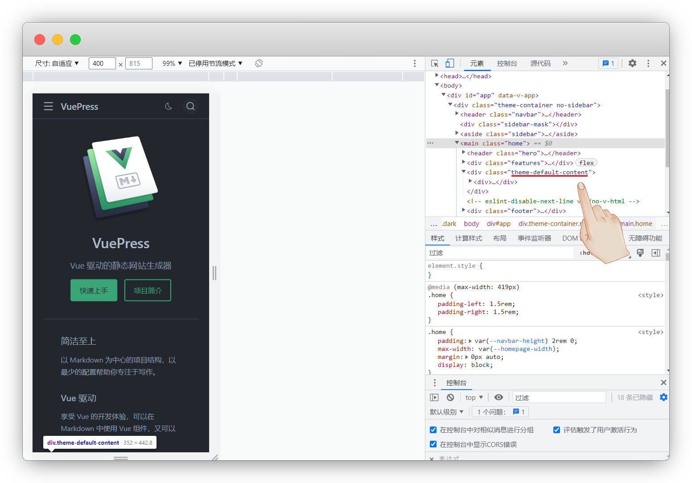
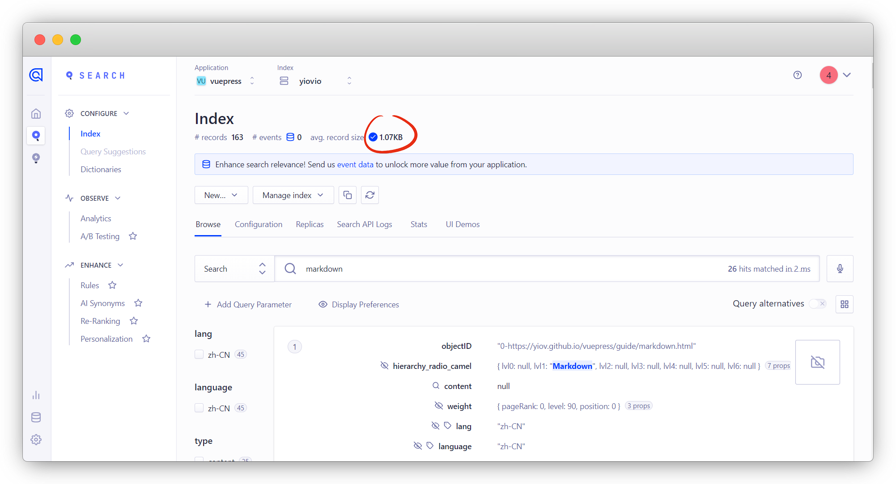
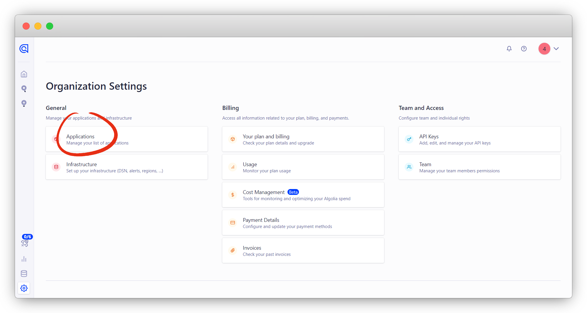

# 插件

::: warning 更新时间
最近更新：2023-5-14

搭建版本：v2.0-beta.61
:::

### 谷歌分析

利用插件 [google-analytics](https://analytics.google.com/) ，来查看网站访问量

安装，不要把npm改成其他


:::: code-group
::: code-group-item pnpm
```sh
pnpm i -D @vuepress/plugin-google-analytics@next
```
:::
::: code-group-item yarn
```sh
npm i -D @vuepress/plugin-google-analytics@next
```
:::
::::


```ts
import { googleAnalyticsPlugin } from '@vuepress/plugin-google-analytics'

export default {
  plugins: [
    googleAnalyticsPlugin({
      id: 'G-XXXXXXXXXX', //跟踪ID
    }),
  ],
}
```

谷歌分析官网：[https://analytics.google.com/](https://analytics.google.com/)

点 `开始衡量`

::: tip 说明
没有账号的注册账号，要翻墙哦
:::


信息随便填，后面都可以改


创建完成，点网站，输入你自己的网站


衡量ID就是跟踪ID，我们填入 `config.ts`


如果不想要了，在账户设置里删除账户

::: tip 说明
删除了在回收站里，要35天后永久删除
:::


## DocSearch

先安装 `docsearch` 插件

::: tip 说明
安装失败，挂个梯子就可以了
:::


:::: code-group
::: code-group-item pnpm
```sh
#这里是pnpm 新增@algolia/client-search
pnpm i -D @vuepress/plugin-docsearch@next @algolia/client-search
```
:::
::: code-group-item yarn
```sh
#这里就是npm，是yarn也不要自己改
npm i -D @vuepress/plugin-docsearch@next
```
:::
::::





然后再ts里添加配置

```ts
import { docsearchPlugin } from '@vuepress/plugin-docsearch'

export default {
  //========docsearch配置========//
  plugins: [
    docsearchPlugin({
      appId: '<APP_ID/Application ID>',
      apiKey: '<API_KEY/Search-Only API Key>',
      indexName: '<INDEX_NAME>',
      locales: {
        '/': {
          placeholder: '搜索文档',
          translations: {
            button: {
              buttonText: '搜索文档',
            },
          },
        },
        '/en/': {
          placeholder: 'Search Documentation',
          translations: {
            button: {
              buttonText: 'Search Documentation',
            },
          },
        },
      },
    }),
  ],
}
```

输出：


DocSearch有2种模式，`免费申请` 和 `自行搭建`

::: tip 区别
免费申请：可使用algolia官方的爬虫，但是需要提交公开仓库代码链接

自行搭建：需自行搭建爬虫，不需要提交仓库代码链接
:::

### 免费申请


DocSearch官网：[https://docsearch.algolia.com/](https://docsearch.algolia.com/)

点 `Apply` 申请，填入你的网址/邮箱/仓库链接即可


::: tip 说明
我点了2次都没有跳转，最后挂了个梯子可以了
:::


等待6-7小时，邮件发送过来

没有注册过的会给我们一个邀请链接，打开并注册账号

::: warning 另外
这里的appid、apikey和indexname我们可以填入`config.ts`
:::


但是我们还是无法搜索，进入[Algolia官网](https://www.algolia.com/)，点 `Search` - `index`

由于官方已经帮我们创建了 `Application` ，我们直接点接受即可


问题发现了，这里的 `records` 值为0，没有数据，爬取数据有问题

::: tip 说明
点刷新看看，我点了也没有用
:::


登录官方爬虫后台进行调试：[https://crawler.algolia.com/](https://crawler.algolia.com/)

再点击官方帮我们申请的Application


点 `Overview` 进来后发现爬虫数据有的，但是Records没有值，说明数据逻辑有问题


点 `Editor` 进来发现了问题，这里多了一个 `/doc` 

::: warning 注意
这里只要确保你的网址都是对的，其他都不要改

特别是apikey不要改！和你申请的apikey不是同一个用途
:::


改过之后点 `Runtest` 测试一下，records有值就是没问题了

点保存，再重新在Overview爬取即可

::: tip 说明
如果还是不行，就对照 [vuepress文档](https://v2.vuepress.vuejs.org/zh/reference/plugin/docsearch.html#%E8%8E%B7%E5%8F%96%E6%90%9C%E7%B4%A2%E7%B4%A2%E5%BC%95) 挨个试

免费的东西自然是问题多
:::




### 自行搭建

步骤有点繁琐，有点耐心看，我都一步步截图了

[Algolia官网](https://www.algolia.com/) 注册并登录账号

::: tip 说明
也可以只用github关联登录注册
:::


注册好后，我们在设置里新建一个Application

::: tip 说明
系统会默认给我们建一个，也是可以用的
:::


创建一个新的应用程序 Applications - Create Application




名称随便，选择 `Free` 免费的方案，下一步

::: tip 说明
爬虫每月1万次，足够用了
:::


这里只能选择默认了，香港这些数据中心都不能选择


勾选同意，创建即可


这样就完成了


创建索引，右下角选择 Date Sources - Indices - Create Index





接下来就是准备好我们的API，上面选择创建的Application

选择 `API keys`

::: tip 说明
Application ID：应用ID

Search-Only API Key：搜索API

Admin API Key：管理API
:::


最后就是爬取索引了，二选一


:::: details Docker爬取索引

我用了 [虚拟机](https://yiov.github.io/website/VMware) 安装了 [docker](https://yiov.github.io/website/docker)，进 [宝塔](https://yiov.github.io/website/BT) 根目录 `root`文件夹

新建一个 `docsearch` 目录

::: tip 说明
名字随便，只要自己记得住就行
:::


新建一个 `.env` 环境变量文件，并填入相应值

```env
APPLICATION_ID=你的Application ID
API_KEY=你的Admin API Key不是search
```


安装 [jq](https://repology.org/project/jq/versions) 一款json解析工具

```sh
yum install jq -y

#版本查询
jq --version
```


在宝塔docsearch目录里新建 `config.json` 文件，用于爬虫的配置，根据提示修改好自己的链接

::: warning 注意
`recordProps` 是用于默认主题的配置，你可以根据你使用的主题来修改

`initialIndexSettings.YOUR_INDEX_NAME.attributesForFaceting` 字段必须包含 `lang`，否则该插件将无法正常工作
:::


只需要修改 `startUrls` 和 `index_name` 其余选项可保持默认

::: tip 说明
startUrls就是你的网站地址
:::

拉取镜像并运行爬虫

::: tip 说明
这里的  `env` 和 `cat` 两个路径，根据自己的改文件路径

格式：`docker run -it --env-file=你的env路径 -e "CONFIG=$(cat 你的配置json路径 | jq -r tostring)" algolia/docsearch-scraper`
:::

```sh
docker run -it --env-file=/root/docsearch/.env -e "CONFIG=$(cat /root/docsearch/config.json | jq -r tostring)" algolia/docsearch-scraper
```


::::


::: details  Github Actions爬取索引

:::


