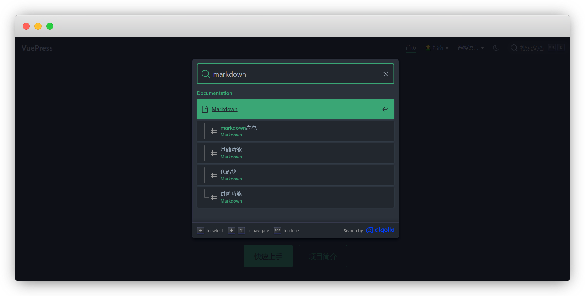
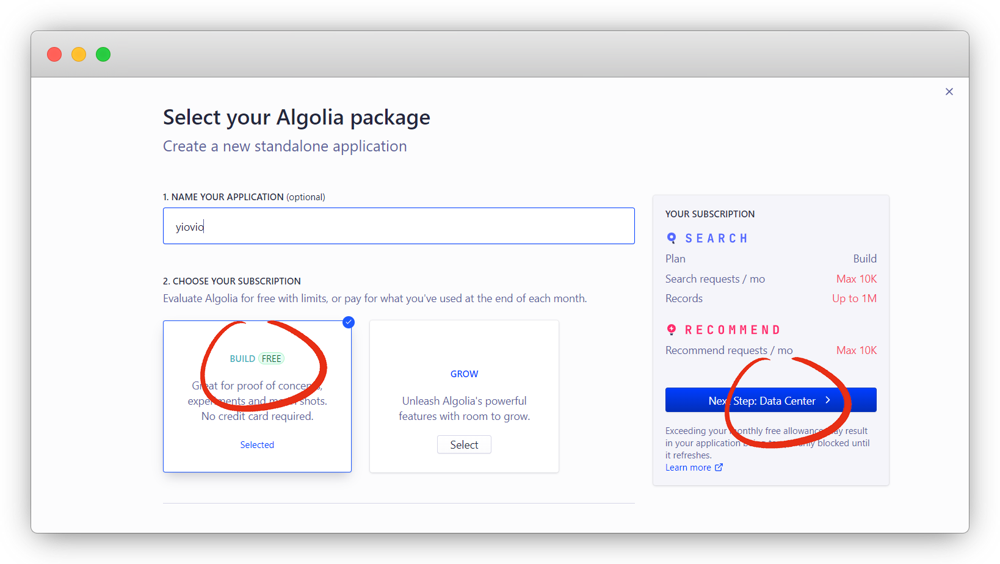
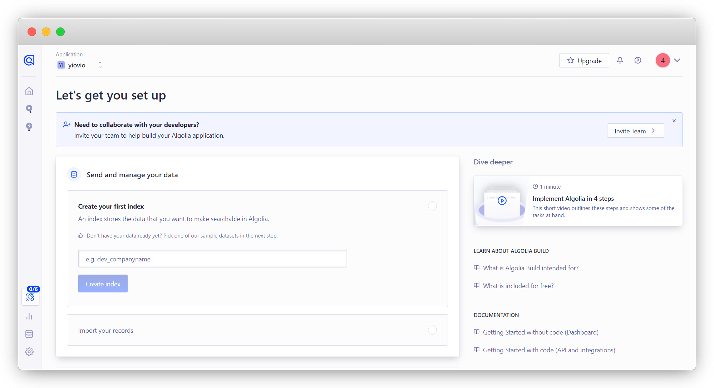
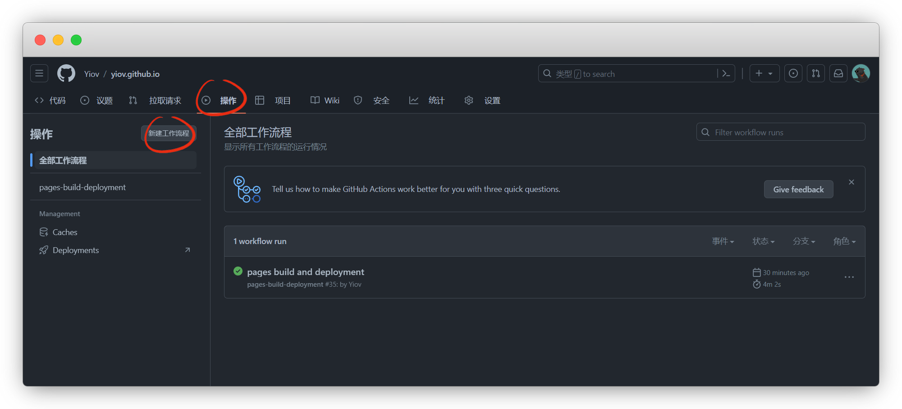

# 插件

::: warning 更新时间
最近更新：2023-6-29

搭建版本：v2.0-beta.63
:::


::: danger 特别说明
如果插件无法引入import，尝试解决

1.关闭vscode后再打开

2.尝试删除 `node_modules` 文件夹后，重新安装依赖，再次安装插件

3.看安装版本是否一致，不一致在 `package.json` 修改后，尝试第2步
:::


## markdown高亮

使用内置插件 `Prism.js` 来为 Markdown 代码块启用高亮

> 测试的时候是内置的，没有我们就来安装一下


:::: code-group
::: code-group-item pnpm
```sh
pnpm add -D @vuepress/plugin-prismjs@next
```
:::
::: code-group-item yarn
```sh
yarn add -D @vuepress/plugin-prismjs@next
```
:::
::: code-group-item npm
```sh
npm i -D @vuepress/plugin-prismjs@next
```
:::
::::


```ts{1,5-8}
import { prismjsPlugin } from '@vuepress/plugin-prismjs'

export default {
  plugins: [
    //markdown代码高亮配置
    prismjsPlugin({
      preloadLanguages:['markdown', 'jsdoc', 'yaml']
    }),
  ],
}
```


## 删除复制链接文字

默认主题中，我们复制站外链接文字会出现多余的文字

::: tip 比如
[Github](https://github.com/) 复制出来是 `GitHub open in new window`

怎么删除后面这个open in new window呢
:::

我们需要安装插件后进行配置，安装

:::: code-group
::: code-group-item pnpm
```sh
pnpm add -D @vuepress/plugin-external-link-icon@next
```
:::
::: code-group-item yarn
```sh
yarn add -D @vuepress/plugin-external-link-icon@next
```
:::
::: code-group-item npm
```sh
npm i -D @vuepress/plugin-external-link-icon@next
```
:::
::::


::: tip 说明
引号内留空就可以了，除非你想个性化
:::

```ts{1,5-14}
import { externalLinkIconPlugin } from '@vuepress/plugin-external-link-icon'

export default {
  plugins: [
    externalLinkIconPlugin({
      locales: {
        '/': {
          openInNewWindow: '在新窗口打开',
        },
        '/en/': {
          openInNewWindow: 'open in new window',
        },
      },
    }),
  ],
}
```


## 谷歌分析

利用插件 [google-analytics](https://analytics.google.com/) ，来查看网站访问量


:::: code-group
::: code-group-item pnpm
```sh
pnpm add -D @vuepress/plugin-google-analytics@next
```
:::
::: code-group-item yarn
```sh
yarn add -D @vuepress/plugin-google-analytics@next
```
:::
::: code-group-item npm
```sh
npm i -D @vuepress/plugin-google-analytics@next
```
:::
::::


```ts
import { googleAnalyticsPlugin } from '@vuepress/plugin-google-analytics'

export default {
  plugins: [
    googleAnalyticsPlugin({
      id: 'G-XXXXXXXXXX', //跟踪ID
    }),
  ],
}
```

谷歌分析官网：[https://analytics.google.com/](https://analytics.google.com/)

点 `开始衡量`

::: tip 说明
没有账号的注册账号，要翻墙哦
:::


信息随便填，后面都可以改


创建完成，点网站，输入你自己的网站


衡量ID就是跟踪ID，我们填入 `config.ts`


如果不想要了，在账户设置里删除账户

::: tip 说明
删除了在回收站里，要35天后永久删除
:::


## DocSearch

先安装 `docsearch` 插件

::: tip 说明
安装失败，挂个梯子就可以了
:::


:::: code-group
::: code-group-item pnpm
```sh
#这里是pnpm 新增@algolia/client-search
pnpm add -D @vuepress/plugin-docsearch@next @algolia/client-search search-insights
```
:::
::: code-group-item yarn
```sh
#这里是yarn 新增@algolia/client-search
yarn add -D @vuepress/plugin-docsearch@next @algolia/client-search search-insights
```
:::
::: code-group-item npm
```sh
#这里是npm 新增@algolia/client-search
npm i -D @vuepress/plugin-docsearch@next @algolia/client-search search-insights
```
:::
::::


然后再ts里添加配置

```ts
import { docsearchPlugin } from '@vuepress/plugin-docsearch'

export default {
  //========docsearch配置========//
  plugins: [
    docsearchPlugin({
      appId: '<Application ID>',
      apiKey: '<Search-Only API Key>',
      indexName: '<INDEX_NAME>',
      locales: {
        '/': {
          placeholder: '搜索文档',
          translations: {
            button: {
              buttonText: '搜索文档',
            },
          },
        },
        '/en/': {
          placeholder: 'Search Documentation',
          translations: {
            button: {
              buttonText: 'Search Documentation',
            },
          },
        },
      },
    }),
  ],
}
```

输出：


DocSearch有2种模式，[免费申请](#免费申请) 和 [自行爬取](#自行爬取前准备)

::: tip 区别
免费申请：可使用algolia官方的爬虫，但是需要提交公开仓库代码链接

自行爬取：需自行搭建爬虫，不需要提交仓库代码链接
:::

### 免费申请


DocSearch官网：[https://docsearch.algolia.com/](https://docsearch.algolia.com/)

点 `Apply` 申请，填入你的网址/邮箱/仓库链接即可


::: tip 说明
我点了2次都没有跳转，最后挂了个梯子可以了
:::


等待6-7小时，邮件发送过来

没有注册过的会给我们一个邀请链接，打开并注册账号

::: warning 另外
这里的appid、indexname我们可以填入 `config.ts`

但是apikey这个没用，需要 `Search-Only API Key` 我们一会再填
:::


通过邀请链接注册并登录进[Algolia官网](https://www.algolia.com/)，点 `Search` - `index`

由于官方已经帮我们创建了 `Application` ，我们直接点接受即可

::: tip 说明
没有弹按钮的，去邮箱复制邀请链接打开就有了
:::


问题发现了，这里的 `records` 值为0，没有数据，爬取数据有问题

::: tip 说明
点刷新看看，我点了也没有用
:::


登录官方爬虫后台进行调试：[https://crawler.algolia.com/](https://crawler.algolia.com/)

再点击官方帮我们申请的Application


点 `Overview` 进来后发现爬虫数据有的，但是Records没有值，说明数据逻辑有问题


点 `Editor` 进来发现了问题，这里多了一个 `/doc` 

::: warning 注意
除了指定位置，其他不要乱改，特别是apikey不要改！和你申请的apikey不是同一个用途

如果你网址有别名解析或者重定向了，就不能用了，只能用你申请时的网址
:::


改过之后点 `Runtest` 测试一下，records还是没有值

原来是class标签不对，用审查元素看了下page也的class是 theme-default-content


那我们将原来的 `.content_default` 全部替换成 `.theme-default-content` 即可


再次 `Run test`，可以在 Search Preview 里可以搜素看看


没问题了点保存，再重新在Overview重新爬取，Records有值就代表OK了


点击index回到algolia，看数据是否同步过来


最后，回到主页查看API KEYS，这里我们将 `Search API Key` 填入 `config.ts` 


本地搜索一下，可以使用了

::: tip 说明
如果还是不行，就对照 [vuepress文档](https://v2.vuepress.vuejs.org/zh/reference/plugin/docsearch.html#%E8%8E%B7%E5%8F%96%E6%90%9C%E7%B4%A2%E7%B4%A2%E5%BC%95) 挨个试

免费的东西自然是费脑筋
:::




### 自行爬取前准备

有点耐心看，我都一步步截图了

[Algolia官网](https://www.algolia.com/) 注册并登录账号

::: tip 说明
也可以只用github关联登录注册
:::


注册好后，我们在设置里新建一个Application

::: tip 说明
系统会默认给我们建一个，也是可以用的
:::

创建一个新的应用程序 Applications - Create Application


名称随便，选择 `Free` 免费的方案，下一步

::: tip 说明
爬虫每月1万次，足够用了
:::



这里只能选择默认了，香港这些数据中心都不能选择

::: tip 说明
香港的只能通过申请，官方给你配，不过即便是美国实测搜索也慢不了多少
:::


勾选同意，创建即可


这样就完成了




创建索引，右下角选择 Date Sources - Indices - Create Index


这个就是我们的索引名，即 indexName ，后面会用到


接下来就是准备好我们的API，上面选择创建的Application

选择 `API keys`

::: tip 说明
Application ID：应用ID

Search-Only API Key：搜索API

Admin API Key：管理API

indexName：索引名
:::


最后就是爬取索引了，二选一

::: tip 说明
我就是被这个整崩溃了，爬取的索引就是用不了，累计耗时半个月，才搞清里面的逻辑
:::


### Docker 爬取

我用了 [虚拟机](https://yiov.github.io/website/VMware) 安装了 [docker](https://yiov.github.io/website/docker)，进 [宝塔](https://yiov.github.io/website/BT) 根目录 `root`文件夹

新建一个 `docsearch` 目录

::: tip 说明
名字随便，只要自己记得住就行
:::


新建一个 `.env` 环境变量文件，并填入相应值

```env
APPLICATION_ID=你的Application ID
API_KEY=你的Admin API Key(非Search)
```


安装 [jq](https://repology.org/project/jq/versions) 一款json解析工具

```sh
#安装jq
yum install jq -y

#版本查询
jq --version
```


在docsearch目录里新建 `config.json` 文件，用于爬虫的配置，根据提示修改好自己的链接

::: tip 说明
当时就是卡在这里了，网上的版本尝试了无数次都不行,于是对照着 [algolia官方旧文档](https://docsearch.algolia.com/docs/legacy/run-your-own/) 挨个试

最后审查元素发现，有个facetFliter里有个lang， 同时vuepress官方也指出 `attributesForFaceting` 必须包含 `lang` 否则无法使用
:::


```json{2,4}
{
  "index_name": "你的索引名",
  "start_urls": [
    "https://你的网址.com/"
  ],
  "stop_urls": [""],
  "selectors": {
    "lvl0": {
      "selector": ".sidebar-heading.active",
      "global": true,
      "default_value": "Documentation"
    },
    "lvl1": ".theme-default-content h1",
    "lvl2": ".theme-default-content h2",
    "lvl3": ".theme-default-content h3",
    "lvl4": ".theme-default-content h4",
    "lvl5": ".theme-default-content h5",
    "text": ".theme-default-content p, .theme-default-content li",
    "lang": {
      "selector": "/html/@lang",
      "type": "xpath",
      "global": true
    }
  },
  "custom_settings": {
    "attributesForFaceting": [
      "lang"
    ]
  }
}
```


只需要修改 `index_name` 和 `startUrls` 其余选项可保持默认

::: tip 说明
`stop_urls` 表示的是爬虫不爬取的链接

因为我的vuepress单独做了索引，不需要就屏蔽掉了
:::


至此我们的前期工作就准备好了，开始爬数据


现在我们拉取镜像并运行爬虫


::: tip 说明
格式：docker run -it --env-file=`你的env路径` -e "CONFIG=$(cat `你的配置json路径` | jq -r tostring)" algolia/docsearch-scraper`

比如我，都放在了root目录里的docsearch文件夹里，自己按需修改文件路径
:::

```sh
docker run -it --env-file=/root/docsearch/.env -e "CONFIG=$(cat /root/docsearch/config.json | jq -r tostring)" algolia/docsearch-scraper
```


回到Algolia看到数据已经有了

::: warning 注意
这里成功了会有个 `lang：zh_CN`，否则有数据也用不了
:::


在 `config.ts` 填上数据后，搜索一次看下成果


### Github Actions爬取

我们先创建一个工作流

::: tip 说明
我因为已经有一个了，我直接新建一个就行
:::




命名为`docsearch.yml` ，复制粘贴下面的工作流代码，提交


:::: code-group
::: code-group-item 发布后触发
```yml
on: deployment
```
:::
::: code-group-item 提交后触发
```yml
on:
  push:
    branches:
      - main
```
:::
::: code-group-item 定时触发
```yml
on:
  schedule:
    # 约每天早上8点触发（UTC时间0点）
    - cron: '0 0 * * *'
```
:::
::: code-group-item 手动触发
```yml
on:
  workflow_dispatch:
```
:::
::::


::: warning 注意
这里触发的条件自己选，改代码高亮的位置就行，其他不要动
:::


```yml{4-8}
# 名字可以自己取
name: docsearch

# 提交main分支触发部署
on:
  push:
    branches:
      - main

jobs:
  algolia:
    runs-on: ubuntu-latest
    steps:
      - uses: actions/checkout@v2

      # 一会要建docsearch.json文件
      - name: Get the content of docsearch.json as config
        id: algolia_config
        run: echo "::set-output name=config::$(cat docsearch.json | jq -r tostring)"

      - name: Run algolia/docsearch-scraper image
        # 环境变量 ，在仓库设置-安全里添加秘钥
        # APPLICATION_ID 是 algoia 的 APPLICATION ID
        # API_KEY 是 algolia 的 Admin API KEY
        # CONFIG默认即可，无需更改
        env:
          APPLICATION_ID: ${{ secrets.APPLICATION_ID }}
          API_KEY: ${{ secrets.API_KEY }}
          CONFIG: ${{ steps.algolia_config.outputs.config }}
        run: |
          docker run \
            --env APPLICATION_ID=${APPLICATION_ID} \
            --env API_KEY=${API_KEY} \
            --env "CONFIG=${CONFIG}" \
            algolia/docsearch-scraper

```


然后在根目录新建一个 `docsearch.json` 文件，复制粘贴并提交

::: tip 说明
记得把索引和网址都改成自己的
:::


```json{2,4}
{
  "index_name": "你的索引名",
  "start_urls": [
    "https://你的网址.com/"
  ],
  "stop_urls": [""],
  "selectors": {
    "lvl0": {
      "selector": ".sidebar-heading.active",
      "global": true,
      "default_value": "Documentation"
    },
    "lvl1": ".theme-default-content h1",
    "lvl2": ".theme-default-content h2",
    "lvl3": ".theme-default-content h3",
    "lvl4": ".theme-default-content h4",
    "lvl5": ".theme-default-content h5",
    "text": ".theme-default-content p, .theme-default-content li",
    "lang": {
      "selector": "/html/@lang",
      "type": "xpath",
      "global": true
    }
  },
  "custom_settings": {
    "attributesForFaceting": [
      "lang"
    ]
  }
}
```


然后再在仓库 - 设置 - Secrets and variables - actions，新增仓库秘钥


分别添加 `APPLICATION_ID` 和 `API_KEY`

::: warning 注意
APPLICATION_ID是 [algolia](https://www.algolia.com/) 的 `APPLICATION ID`

API_KEY是 [algolia](https://www.algolia.com/) 的 `Admin API Key`

千万不要填错了
:::


我们提交一次代码，等工作流跑完，我们试试搜索结果


### 索引美化

这是官网原文档的索引，有明显的分类，很美观


折腾了半天发现，并没有解决

找到了一个 [相对完善的解答：@How to setup Algolia DocSearch](https://www.howtocode.io/posts/algolia/how-to-setup-algolia-doc-search#doc-search-config) ，但是依然没搞定，这个放在以后弄吧


:::: details 初步尝试 失败

我们将在原本的 `start_urls` 和 `selectors` 里变更

这里我们添加一个选择词 `selectors_key` 和标签

```json{2-4,6-14}
/* 原来的
"start_urls": [
  "https://yiov.github.io/"
],
*/
//现在的，使用的时候删掉这段注释
"start_urls": [
    "https://yiov.github.io/",
    {
      "url": "https://yiov.github.io/gfw",
      "selectors_key": "gfw",
      "tags": ["gfw"]
    }
  ],
```

然后创建一个相对应的选择对象，并将 `selector` 留空， `default_value` 为搜索结果的标题

::: warning 注意
这里除了我创建的 `gfw` ，还有个 `default` ，是默认的必须要带，是搜索除了gfw以外的所有对象
:::

```json{2-19,22-54}
/* 原来的
"selectors": {
    "lvl0": {
      "selector": ".sidebar-heading.active",
      "global": true,
      "default_value": "Documentation"
    },
    "lvl1": ".theme-default-content h1",
    "lvl2": ".theme-default-content h2",
    "lvl3": ".theme-default-content h3",
    "lvl4": ".theme-default-content h4",
    "lvl5": ".theme-default-content h5",
    "text": ".theme-default-content p, .theme-default-content li",
    "lang": {
      "selector": "/html/@lang",
      "type": "xpath",
      "global": true
    }
  },
*/
//现在的，使用的时候删掉这段注释
"selectors": {
    "gfw": {
      "lvl0": {
        "selector": "  ",
        "global": true,
        "default_value": "科学上网"
      },
      "lvl1": ".theme-default-content h1",
    "lvl2": ".theme-default-content h2",
    "lvl3": ".theme-default-content h3",
    "lvl4": ".theme-default-content h4",
    "lvl5": ".theme-default-content h5",
    "text": ".theme-default-content p, .theme-default-content li"
    },
    "default": {
      "lvl0": {
        "selector": "",
        "global": true,
        "default_value": "文档"
      },
      "lvl1": ".theme-default-content h1",
      "lvl2": ".theme-default-content h2",
      "lvl3": ".theme-default-content h3",
      "lvl4": ".theme-default-content h4",
      "lvl5": ".theme-default-content h5",
      "text": ".theme-default-content p, .theme-default-content li",
      "lang": {
        "selector": "/html/@lang",
        "type": "xpath",
        "global": true
      }
    }
  },
```
::::


### 样式美化

你可以通过 [@docsearch/css](https://docsearch.algolia.com/docs/styling/) 提供的 CSS 变量来自定义样式

如果你不懂方法，[可以参照样式美化的方法](http://localhost:8080/vuepress/guide/beautification.html#样式美化)

```css
:root {
  --docsearch-primary-color: rgb(84, 104, 255);
  --docsearch-text-color: rgb(28, 30, 33);
  --docsearch-spacing: 12px;
  --docsearch-icon-stroke-width: 1.4;
  --docsearch-highlight-color: var(--docsearch-primary-color);
  --docsearch-muted-color: rgb(150, 159, 175);
  --docsearch-container-background: rgba(101, 108, 133, 0.8);
  --docsearch-logo-color: rgba(84, 104, 255);

  /* modal */
  --docsearch-modal-width: 560px;
  --docsearch-modal-height: 600px;
  --docsearch-modal-background: rgb(245, 246, 247);
  --docsearch-modal-shadow: inset 1px 1px 0 0 rgba(255, 255, 255, 0.5), 0 3px
      8px 0 rgba(85, 90, 100, 1);

  /* searchbox */
  --docsearch-searchbox-height: 56px;
  --docsearch-searchbox-background: rgb(235, 237, 240);
  --docsearch-searchbox-focus-background: #fff;
  --docsearch-searchbox-shadow: inset 0 0 0 2px var(--docsearch-primary-color);

  /* hit */
  --docsearch-hit-height: 56px;
  --docsearch-hit-color: rgb(68, 73, 80);
  --docsearch-hit-active-color: #fff;
  --docsearch-hit-background: #fff;
  --docsearch-hit-shadow: 0 1px 3px 0 rgb(212, 217, 225);

  /* key */
  --docsearch-key-gradient: linear-gradient(
    -225deg,
    rgb(213, 219, 228) 0%,
    rgb(248, 248, 248) 100%
  );
  --docsearch-key-shadow: inset 0 -2px 0 0 rgb(205, 205, 230), inset 0 0 1px 1px
      #fff, 0 1px 2px 1px rgba(30, 35, 90, 0.4);

  /* footer */
  --docsearch-footer-height: 44px;
  --docsearch-footer-background: #fff;
  --docsearch-footer-shadow: 0 -1px 0 0 rgb(224, 227, 232), 0 -3px 6px 0 rgba(69, 98, 155, 0.12);
}
```


## 复制代码块

默认主题没有添加这个功能，我们可以用第三方插件

官网：[https://plugin-copy-code2.vuejs.press/zh/](https://plugin-copy-code2.vuejs.press/zh/)

安装

:::: code-group
::: code-group-item pnpm
```sh
pnpm add -D vuepress-plugin-copy-code2
```
:::
::: code-group-item yarn
```sh
yarn add -D vuepress-plugin-copy-code2
```
:::
::: code-group-item npm
```sh
npm i -D vuepress-plugin-copy-code2
```
:::
::::


```ts{1,5-7}
import { copyCodePlugin } from 'vuepress-plugin-copy-code2'

export default {
  plugins: [
    copyCodePlugin({
      // 插件选项
    }),
  ],
};
```


## 更多其他插件

其他第三方插件：[https://github.com/vuepress/awesome-vuepress/blob/main/v2.md](https://github.com/vuepress/awesome-vuepress/blob/main/v2.md)

::: tip 建议
更多插件请进原文档查看，本列表仅复制而来
:::

- [vuepress-plugin-blog2](https://plugin-blog2.vuejs.press): VuePress2 Blog plugin📝 facing theme developers
- [vuepress-plugin-comment2](https://plugin-comment2.vuejs.press): VuePress2 comment plugin💬, supports Giscus, Twikoo and Waline.
- [vuepress-plugin-components](https://plugin-components.vuejs.press): Markdown components out of box🧩
- [vuepress-plugin-copy-code2](https://plugin-copy-code2.vuejs.press): VuePress2 copy code plugin📋, provide copy button for code blocks.
- [vuepress-plugin-copyright2](https://plugin-copyright2.vuejs.press): VuePress2 copyright plugin📋

  Append copyright information while copying, also supports disabling copying and selection.

- [vuepress-plugin-feed2](https://plugin-feed2.vuejs.press): VuePress2 feed plugin 📡, supporting atom, json and rss syntax feeds
- [vuepress-plugin-md-enhance](https://plugin-md-enhance.vuejs.press/): VuePress2 Markdown enhancement plugin📄

  Fully tree-shakable, features including attrs, tabs, code tabs, hint boxes, footnote, mark, subscript, superscript, snippets, imageTitle, imageLazyload, imageSize, imageMark, custom alignment, task lists, chart.js, flowchart.js, katex, mathjax, diagrams (mermaid), slides (reveal.js), playground, vue playground, code demos, etc.

- [vuepress-plugin-photo-swipe](https://plugin-photo-swipe.vuejs.press/): VuePress2 photo preview plugin🔍 based on `photo-swipe`
- [vuepress-plugin-pwa2](https://plugin-pwa2.vuejs.press/): VuePress2 PWA plugin📦, an improved edition over the official one.
- [vuepress-plugin-reading-time2](https://plugin-reading-time2.vuejs.press/): VuePress2 reading time plugin⏳
- [vuepress-plugin-redirect](https://plugin-redirect.vuejs.press/): VuePress2 redirect plugin↩️, performing automatically redirects from old links to new ones
- [vuepress-plugin-sass-palette](https://plugin-sass-palette.vuejs.press/): VuePress2 palette plugin for sass🎨, an improved edition over the official one.
- [vuepress-plugin-search-pro](https://plugin-search-pro.vuejs.press/): VuePress2 plugin to provide client search, an improved edition over the official one.
- [vuepress-plugin-seo2](https://plugin-seo2.vuejs.press/): VuePress2 SEO plugin🛠, supports OGP and JSON-LD
- [vuepress-plugin-sitemap2](https://plugin-sitemap2.vuejs.press/): VuePress2 Sitemap plugin🗺️
- [vuepress-plugin-lightgallery](https://plugin-lightgallery.vuejs.press): Light Gallery plugin for VuePress2 (to provide image preview)
- [vuepress-plugin-use-pages](https://github.com/monsat/vuepress-plugin-use-pages) - VuePress2 plugin that helps you use array of all PagesData in your doc.
- [@snippetors/vuepress-plugin-tabs](https://www.npmjs.com/package/@snippetors/vuepress-plugin-tabs) - VuePress2 plugin which renders custom markdown containers as tabs, for vuepress v2.x
- [vuepress-plugin-archive](https://www.npmjs.com/package/vuepress-plugin-archive) - VuePress2 plugin that add article archiving and timeline functions to the site, for vuepress v2.x
- [vuepress-plugin-netabare-switch](https://github.com/monsat/vuepress-plugin-netabare-switch) - VuePress2 plugin to add toggle switch for spoilers.
- [vuepress-plugin-china-search-console](https://vuepress.qbb.sh/china-search-console/) - 🌐 VuePress2 plugin to enhance china seo | include **baidu tongji (analytics)**, baidu auto push, 360 autopush, tiaotiao(ByteDance) autopush.
- [vuepress-plugin-imagemin](https://github.com/yjl9903/vuepress-plugin-imagemin): VuePress2 plugin for compressing image assets.
- [@goy/vuepress-plugin-svg-icons](https://github.com/ntnyq/vuepress-plugin-svg-icons): VuePress2 plugin for managing svg icons via svg sprite
- [vuepress-plugin-social-share](https://github.com/ntnyq/vuepress-plugin-social-share/tree/next): VuePress2 plugin which provides social sharing services
- [vuepress-plugin-iconify](https://github.com/ntnyq/vuepress-plugin-iconify): VuePress2 plugin make it easier to use icons in VuePress
- [vuepress-plugin-netlify-functions](https://github.com/pengzhanbo/vuepress-theme-plume/tree/main/packages/plugin-netlify-functions) VuePress2 plugin to basis support for netlify functions when you want deploy to netlify and use netlify functions.
- [vuepress-plugin-markdown-define2](https://github.com/justforuse/vuepress-plugin-markdown-define2): VuePress2 plugin to define variables in markdown.
- [@condorhero/vuepress-plugin-export-pdf-v2](https://github.com/condorheroblog/vuepress-plugin/tree/main/packages/vuepress-plugin-export-pdf-v2): VuePress2 plugin exports your website as a PDF file.
- [vuepress-plugin-anchor-right](https://github.com/dingshaohua-cn/vuepress-plugin-anchor-right): VuePress2 plugin,It is used to generate the right navigation directory anchor!
- [vuepress-plugin-open-graph](https://github.com/azat-io/vuepress-plugin-open-graph): Plugin for generating open graph meta tags
- [vuepress-plugin-remove-html-extension](https://github.com/azat-io/vuepress-plugin-remove-html-extension): Plugin for generating clean urls
- [vuepress-plugin-umami-analytics](https://github.com/azat-io/vuepress-plugin-umami-analytics): Plugin for using Umami analytics
- [vuepress-plugin-alert](https://github.com/wuwb/vuepress-plugin-alert): Plugin for add site announcement on the top right corner.
- [vuepress-plugin-blog-sync](https://github.com/flytam/vuepress-plugin-blog-sync): Input blog site info, generate VuePress2 site automatically | 输入网站基本信息，一键生成 VuePress2 文档站
- [@cinar/wordpress-to-vuepress-migration](https://github.com/cinar/wordpress-to-vuepress-migration): WordPress to VuePress 2 migration script.
- [vuepress-plugin-github-linkify](https://github.com/TheDragonCode/vuepress-plugin-github-linkify): Adding and fixing GitHub links


- [vuepress-plugin-full-text-search2](https://github.com/ota-meshi/vuepress-plugin-full-text-search2): VuePress2 plugin that adds full-text search box.
- [vuepress-plugin-mermaid-wrapper](https://github.com/azat-io/vuepress-plugin-mermaid-wrapper): Plugin for using Mermaid.js
- [vuepress-plugin-clipboard](https://vuepress.qbb.sh/clipboard/): 🔘 VuePress2 plugin to generate **code copy button** | 代码块复制按钮
- [@snippetors/vuepress-plugin-code-copy](https://www.npmjs.com/package/@snippetors/vuepress-plugin-code-copy) - VuePress2 plugin which provides a button to copy code block, for vuepress v2.x
- [@yanyu-fe/vuepress-plugin-code-block](https://github.com/yanyu-fe/vuepress-plugins/tree/main/plugins/code-block) - VuePress2 plugin for used to generate component code blocks.